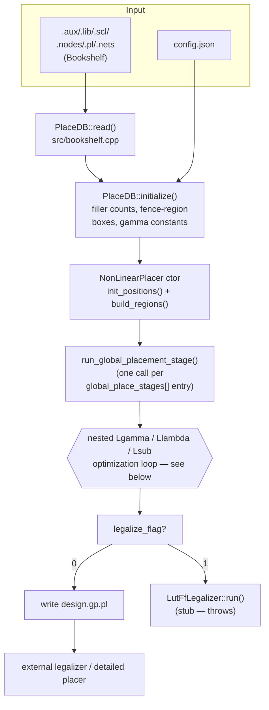
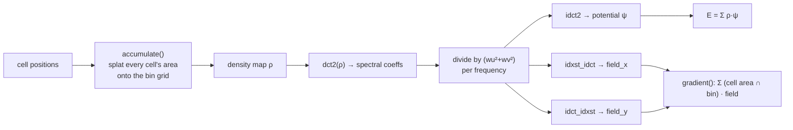
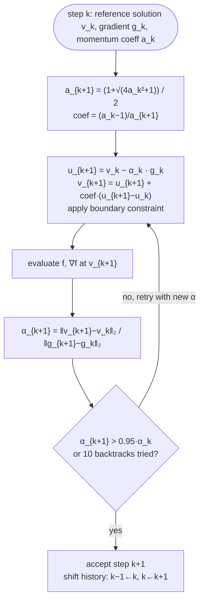
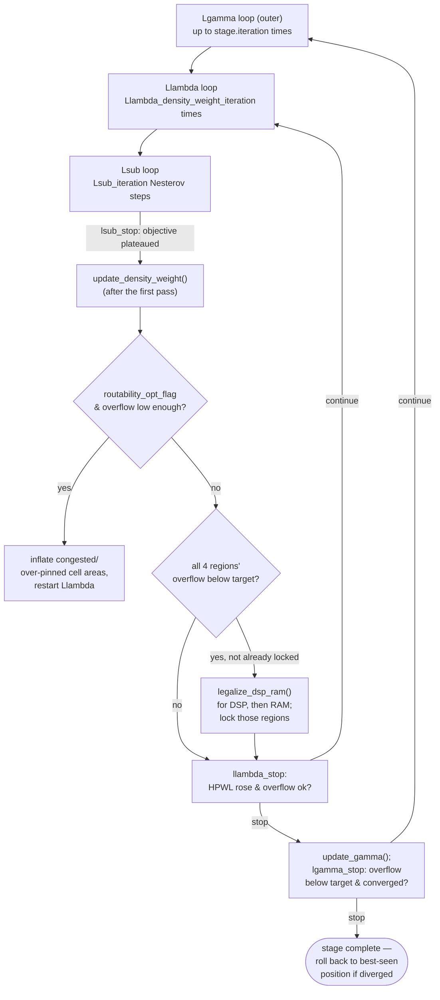

# dpfpga architecture, theory, and algorithms

This document explains how `dpfpga` places a design: the FPGA placement problem it
solves, the electrostatic-analogy algorithm it uses (ePlace/elfPlace, as implemented by
DREAMPlaceFPGA), how that maps onto this codebase's modules, and what we verified — and
didn't — when comparing this port against the original.

## Contents

- [The problem: FPGA placement](#the-problem-fpga-placement)
- [Pipeline overview](#pipeline-overview)
- [The data model](#the-data-model)
- [Theory: wirelength as a smooth objective](#theory-wirelength-as-a-smooth-objective)
- [Theory: density as an electrostatic field](#theory-density-as-an-electrostatic-field)
- [The combined objective and its gradient](#the-combined-objective-and-its-gradient)
- [Optimizer: Nesterov's accelerated gradient](#optimizer-nesterovs-accelerated-gradient)
- [The nested optimization loop](#the-nested-optimization-loop)
- [Adaptive scheduling: density weight and gamma](#adaptive-scheduling-density-weight-and-gamma)
- [DSP/RAM legalization: min-cost bipartite assignment](#dspram-legalization-min-cost-bipartite-assignment)
- [Routability-driven area inflation](#routability-driven-area-inflation)
- [A DSP/RAM-free variant benchmark](#a-dsp-ram-free-variant-benchmark)
- [Known limitations](#known-limitations)
- [References](#references)

## The problem: FPGA placement

Placement takes a synthesized netlist (LUTs, flip-flops, DSP blocks, RAM blocks, fixed
I/O pads) and a target FPGA architecture (a grid of sites, each site accepting only
certain resource types) and decides where every instance goes, such that:

1. every instance sits on a site of the matching type, and no site is double-booked
   (**legality**),
2. the design is routable with the FPGA's limited wiring resources (**routability**),
3. total wirelength — and, downstream, timing — is as good as possible (**quality**).

Doing this in one shot is hard, so real flows split it into three stages:

**`dpfpga` implements only the first stage, Global Placement**, plus one piece that
elfPlace-style flows fold into it: DSP/RAM legalization (there are so few DSP/RAM
instances relative to LUT/FF that they can be snapped onto legal sites analytically
once the rest of the design has spread out, rather than needing a full packer).

## Pipeline overview

Concretely, this is `apps/dreamplacefpga.cpp`'s `main()` → `place_fpga()`:
`PlaceDB::read()` and `::initialize()` build the database, `NonLinearPlacer`
(`src/global_placer.cpp`) owns the whole optimization, and the CLI writes out whatever
solution comes back.

## The data model

Everything is stored as flat `std::vector`s indexed by integer IDs — no per-node
objects, no pointers-to-objects — which is what makes the OpenMP-parallel hot loops
possible. The two structs to know:

- **`PlaceDB`** (`include/dpfpga/placedb.hpp`) — the parsed, mostly-static design: node
  names/types/sizes, pin offsets, the flattened net→pin and node→pin adjacency, the
  device's site map, and derived constants (bin size, gamma constants, per-resource
  filler counts). Built once by `read()` + `initialize()`.
- **`PlaceData`** (`include/dpfpga/place_data.hpp`) — small working copies derived from
  `PlaceDB` that the *routability* optimization is allowed to mutate at runtime (cell
  sizes and pin offsets get inflated to relieve congestion — see
  [below](#routability-driven-area-inflation) — without touching the original database).

Node order is significant and fixed: **movable nodes, then fixed "terminal" (I/O)
nodes, then filler nodes** (added by `initialize()` to fill the whitespace a real
netlist leaves behind — density-based placement needs *something* occupying free space,
or it has no pressure to spread cells apart from each other). Every node also belongs to
exactly one of five **fence regions** — `kLUT`, `kFF`, `kDSP`, `kRAM`, `kIO` — and LUT/FF/
DSP/RAM each get their own independent density field (`RegionDensity`, one per region;
see below), since a LUT can't help relieve DSP congestion and vice versa.

## Theory: wirelength as a smooth objective

The real objective — half-perimeter wirelength (HPWL), the bounding-box width plus
height of every net — is piecewise-linear and non-differentiable at bounding-box
boundary changes, which gradient descent can't handle directly. `ops::hpwl()`
(`src/ops.cpp`) computes it exactly for reporting, but the *optimizer* instead descends a
smooth stand-in: the **weighted-average (log-sum-exp) wirelength**,

$$
\mathrm{WA}(x) \;=\; \gamma \Big[ \ln\!\sum_i e^{x_i/\gamma} \Big] \;-\; \gamma \Big[ \ln\!\sum_i e^{-x_i/\gamma} \Big]
$$

evaluated per axis per net, where $\gamma$ (the code's `gamma`) is a smoothing
parameter. As $\gamma \to 0$, this converges to the true bounding-box span; a larger
$\gamma$ smooths it out, trading accuracy for a better-conditioned gradient early in
optimization when cells are all overlapping. `ops::weighted_average_wirelength()`
computes both this value and its analytic gradient in one pass (the numerically-stable
max-subtracted form seen in the code avoids overflow in the exponentials). $\gamma$ is
*annealed down* over the run — see [gamma scheduling](#adaptive-scheduling-density-weight-and-gamma).

## Theory: density as an electrostatic field

This is the part that gives ePlace its name and its accuracy. Treat every cell as a
"charge" with density equal to (area / footprint), spread over a grid of bins. Overlap
between cells shows up as regions of excess charge density. The electrostatic *potential*
$\psi$ of that charge distribution $\rho$ solves the 2D Poisson equation

$$
\nabla^2 \psi \;=\; -\rho ,
\qquad
\text{energy } E = \tfrac12 \sum_{\text{bins}} \rho \,\psi ,
\qquad
\text{force} = -\nabla \psi
$$

— exactly electrostatics, hence the name. The force naturally points from
high-density regions toward low-density ones: *pushing overlapping cells apart* is
precisely what minimizing this energy does, and it does so smoothly (unlike a hard
non-overlap constraint), which is what makes it usable inside gradient descent.

**Solving Poisson's equation.** On a uniform grid with periodic-ish (Neumann) boundary
conditions, this has a closed form in the frequency domain: take the 2D DCT of the
density map, divide by $(w_u^2+w_v^2)$ per frequency, and take the inverse DCT/DST back.
`include/dpfpga/dct.hpp` + `src/dct.cpp` implement exactly this — a small from-scratch
FFT-based DCT-II/DCT-III/DST library (falling back to an $O(N^2)$ direct table for
non-power-of-two bin counts, though the placer always uses 512 bins so the FFT path is
what actually runs) — and `RegionDensity::energy()`/`gradient()`
(`include/dpfpga/density.hpp`, `src/density.cpp`) drive it:

Each of the four movable resource regions (LUT, FF, DSP, RAM) gets its **own**
`RegionDensity` instance — its own bin grid, its own DCT plan, its own energy/gradient —
because a LUT overflowing a bin says nothing about whether that bin has room for a DSP
(DSP and RAM sites are physically much sparser than LUT/FF slices). `ops::demand_maps()`
precomputes each region's *fixed demand* — how much of each bin's area is already
unavailable to that resource type, from the device's own site layout — once, up front.

**Fillers.** A sparse netlist on a mostly-empty device has almost no natural density
pressure — nothing pushes cells toward reasonable spacing. `PlaceDB::initialize()` fills
each region's unused placeable area with lightweight *filler* nodes (no wirelength
connections, pure density mass) sized to bring `target_density` up to 1.0 everywhere,
giving the density gradient something to work with across the whole region, not just
near real cells.

## The combined objective and its gradient

`PlaceObjective::obj_and_grad()` (`src/objective.cpp`) combines the two pieces per
region $r$:

$$
f(x) \;=\; \mathrm{WA}(x) \;+\; \sum_{r} w_r \, E_r(x)\,\big(1 + q_r E_r(x)\big)
$$

— weighted-average wirelength plus a per-region density energy term, where $w_r$ is
that region's adaptively-scheduled *density weight* and the $(1+q_r E_r)$ factor is a
quadratic penalty (elfPlace's stabilization term, activated once density weights start
climbing) that discourages the optimizer from letting overflow spike again after it's
been brought down. The gradient is the sum of the wirelength gradient
(`ops::pin_pos_grad` over `ops::weighted_average_wirelength`'s per-pin gradient) and
each region's scaled density gradient (`RegionDensity::gradient()`).

Before either gradient is used to move anything, `PlaceObjective::precondition()`
divides it by a **per-node preconditioner**: wirelength-pin-count contribution plus
(area × density weight). This keeps a single learning rate sane across wildly different
node sizes and net degrees — a 200-pin DSP block and a 2-pin filler cell would otherwise
need completely different step sizes.

## Optimizer: Nesterov's accelerated gradient

`NesterovOptimizer` (`include/dpfpga/objective.hpp`, `src/objective.cpp`) implements
e-place's Algorithm 2 — Nesterov's accelerated gradient method with a self-tuning step
size, no external learning-rate schedule needed:

The step size $\alpha_k$ is estimated from the secant relation between consecutive
positions and gradients (Barzilai–Borwein-style), then *re-estimated after every trial
step*; if the new estimate isn't close to the old one (within 5%), the step is
considered untrustworthy and retried with the corrected $\alpha$ — up to 10 times. This
is what lets the optimizer run with **no fixed learning rate schedule**: the initial
guess (`PlaceObjective::estimate_initial_learning_rate()`, a small trial step to bootstrap
the same secant estimate) only has to be roughly right.

## The nested optimization loop

`NonLinearPlacer::run_global_placement_stage()` (`src/global_placer.cpp`) runs three
nested loops per global-placement stage, named for elfPlace's own terminology:

Each level has its own stopping check, all comparing recent `Metrics` snapshots
(HPWL, per-region overflow, max density) — `lsub_stop` looks for the objective
plateauing over a short window, `llambda_stop`/`lgamma_stop` look for overflow dropping
below `target_overflow` *and* HPWL turning the corner (starting to rise again, meaning
further spreading is trading away wirelength for no remaining overflow benefit).

## Adaptive scheduling: density weight and gamma

Two schedules evolve as the placement converges, both per elfPlace's design:

- **Gamma** (`PlaceObjective::update_gamma()`) anneals the wirelength smoothing down as
  overflow drops: $\gamma_r = \text{base}_r \cdot 10^{(k_r \cdot \text{overflow}_r + b_r)}$
  per region, blended by each region's share of total wirelength-preconditioner mass. Low
  overflow (a nearly-spread placement) means a *sharper* (smaller $\gamma$) wirelength
  model is safe to use, since bounding boxes are more meaningful once cells aren't all on
  top of each other.
- **Density weight** (`initialize_density_weight()` / `update_density_weight()` /
  `reset_density_weight()`) starts small (density barely matters while wirelength
  dominates the early, tightly-clustered state) and grows using the ratio of the
  wirelength gradient's L1 norm to the density gradient's L1 norm, so the two forces stay
  balanced as both magnitudes shift over the run. Once a region's overflow first drops
  below its `target_overflow`, that region's weight *freezes* (and its gradient gets
  zeroed in `precondition()`) — a converged region stops moving and lets the others catch
  up, rather than continuing to spread past the point of diminishing returns.

## DSP/RAM legalization: min-cost bipartite assignment

LUT and FF instances get packed and legalized by a dedicated packer (not ported here —
see [Status](../README.md#status)), but DSP and RAM blocks are so much sparser (a
handful of instances against thousands of LUT/FF) that elfPlace legalizes them directly
during global placement: once *every* region's overflow is below target,
`legalize_dsp_ram()` (`src/legalize_dsp_ram.cpp`) snaps all DSP instances (then all RAM
instances) onto distinct legal sites by solving

$$
\min \sum_{i} \big(|dx_i| + |dy_i|\big)\cdot w_i
\quad\text{s.t. each instance} \to \text{a distinct site}
$$

as a **min-cost bipartite matching**, via a from-scratch successive-shortest-augmenting-
path min-cost flow (Dijkstra with Johnson potentials, since all costs are non-negative)
over a growing search radius — arcs are added in expanding distance windows so the
solver never has to consider `O(instances × sites)` arcs when a small window already
gives a feasible perfect matching. Once legalized, those regions' density fields are
**locked** (`RegionDensity::lock()`) — DSP/RAM stop contributing to the density gradient
at all for the rest of the run, since they're now fixed in place.

## Routability-driven area inflation

Analytical placement's wirelength objective doesn't know anything about routing
congestion or pin density directly — a placement that's optimal on paper can still be
unroutable if too many nets crowd through one area, or too many pins crowd into one
bin. When `routability_opt_flag` is set, three estimators
(`include/dpfpga/routability.hpp`, `src/routability.cpp`) periodically check for this and
inflate the *cell sizes* (not their real footprint — just the size the density model
sees) of the worst offenders, giving the density gradient a reason to spread them out
further:

- **`RudyMap`** — Rectangular Uniform wire DensitY: distributes each net's estimated
  wire demand uniformly over its bounding box, giving a fast per-bin routing-congestion
  proxy without an actual router.
- **`PinUtilizationMap`** — pins-per-unit-area relative to a capacity constant, catching
  pin-crowding independent of wire congestion.
- **`lut_compatibility_areas()` / `ff_compatibility_areas()`** — inflate LUT/FF areas
  that violate the FPGA slice's clustering rules (limited distinct clock/reset/enable
  signals per slice), a resource-legality concern rather than routing congestion, but
  handled by the same area-inflation mechanism.

`AdjustNodeArea::run()` combines whichever maps are enabled, inflates the worst
outliers up to `max_pin_opt_adjust_rate`/`max_route_opt_adjust_rate`, and reports back
which categories still need another round; `global_placer.cpp` uses that to decide
whether to keep adjusting or move on.

## A DSP/RAM-free variant benchmark

`scripts/derive_no_dsp_ram_benchmark.py` and `benchmarks/.../FPGA-example1-noDSPRAM/`
exist because of an investigation worth recording: on `FPGA-example1` (which has only 2
DSP and 2 RAM instances against 3264 LUT/FF), the DSP/RAM legalization trigger requires
*all four* regions' overflow below target on the same evaluated iteration, and with only
2 instances per region that alignment turned out to be highly sensitive to the exact
optimization trajectory — different random seeds could mean the difference between DSP/
RAM legalizing at iteration ~1400 (matching the original closely) or never legalizing
within the 2000-iteration budget (HPWL ~30x worse). Removing DSP/RAM entirely — the
script strips those instances from `.nodes` and their pins from `.nets`, leaving
everything else (including the device's site map) untouched — gives a clean, seed-robust
LUT/FF-only benchmark for isolating that behavior from genuine placement-quality
questions. See [Known limitations](#known-limitations) for how that investigation
concluded.

## Known limitations

Two real, distinct gaps were found (and are *not* fixed, by design — see below) while
validating this port against the original DREAMPlaceFPGA on identical benchmarks and
configs:

1. **This port's `random_seed` no longer does anything** (as of this repository's
   current state), matching an actual bug in the original: `BasicPlaceFPGA.__init__`
   sets `torch.manual_seed(params.random_seed)`, then two lines later unconditionally
   overwrites both NumPy's and PyTorch's global RNG state with a hardcoded
   `manualSeed = 0` before any placement randomness is drawn — so the original's GP
   result is independent of the configured seed too (verified empirically: two configs
   differing *only* in `random_seed` produced byte-identical logs). This port's own RNG
   is now likewise seeded with a fixed constant regardless of config, for behavioral
   parity — see `NonLinearPlacer`'s constructor in `src/global_placer.cpp`.

2. **Runs aren't bit-reproducible even with a fixed seed**, because the OpenMP
   `reduction(...)` clauses used in the density accumulation and DCT hot loops don't fix
   a summation order — whichever thread's chunk happens to finish first merges first,
   and floating-point addition isn't associative. Two runs of the identical config were
   observed to match to 1 ULP for hundreds of iterations, then diverge completely by
   iteration ~450 — this is a chaotic nonlinear optimizer, so a single-ULP perturbation
   eventually amplifies into a qualitatively different trajectory. `Params::deterministic_flag`
   is parsed but not yet wired to anything; the original threads an analogous flag (and a
   `sorted_node_map`) through its ops specifically to force a fixed accumulation order,
   which this port does not yet replicate.

Both of these were root-caused, not just observed: they explain why HPWL comparisons
against the original vary by seed/run (10,840 to 69,166 across different C++-RNG seeds
on one benchmark, against the original's single fixed ~10,665-10,872), while the
*algorithm itself* — every formula for wirelength, density energy/gradient, the
Nesterov step, the weight/gamma schedules, the legalization trigger — was checked
line-by-line against the original's Python source and matches. Early-iteration HPWL
(before chaotic amplification has had time to act) matches the original to 5+
significant figures on every benchmark tested.

## References

- Lin, Y. et al., "DREAMPlace: Deep Learning Toolkit-Enabled Accelerated Global
  Placement" (2019) — the ASIC placer DREAMPlaceFPGA and this port both build on.
- Rajarathnam, R.S. et al., "DREAMPlaceFPGA: An Open-Source Analytical Placer for Large
  Scale Heterogeneous FPGAs using Deep-Learning Toolkit", ASP-DAC 2022.
- Rajarathnam, R.S. et al., "DREAMPlaceFPGA-PL: An Open-Source GPU-Accelerated
  Packer-Legalizer for Heterogeneous FPGAs", ISPD 2023.
- Lu, J. et al., "ePlace: Electrostatics-Based Placement Using Fast Fourier Transform
  and Nesterov's Method" (2015).
- Liu, W.-K. et al., "elfPlace: Electrostatics-Based Placement for Large-Scale
  Heterogeneous FPGAs" (2020).
- [ISPD'2016 FPGA placement contest](http://www.ispd.cc/contests/16/FAQ.html) — source
  of the bundled `FPGA-example1` benchmark.
